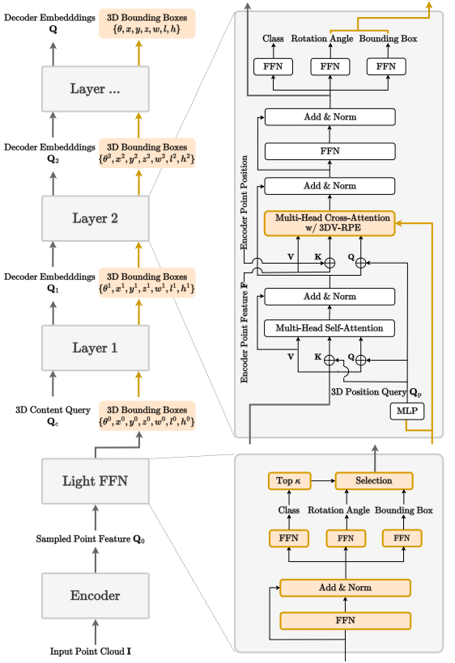
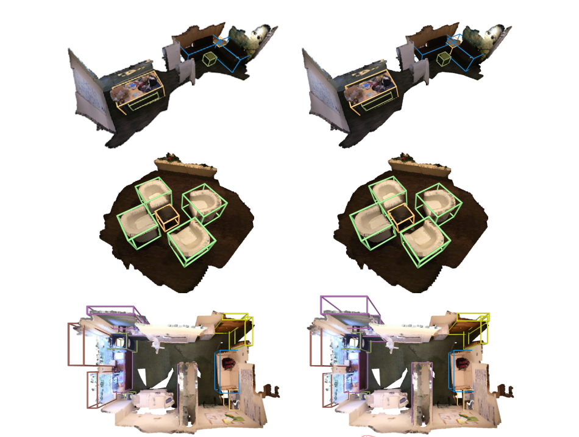
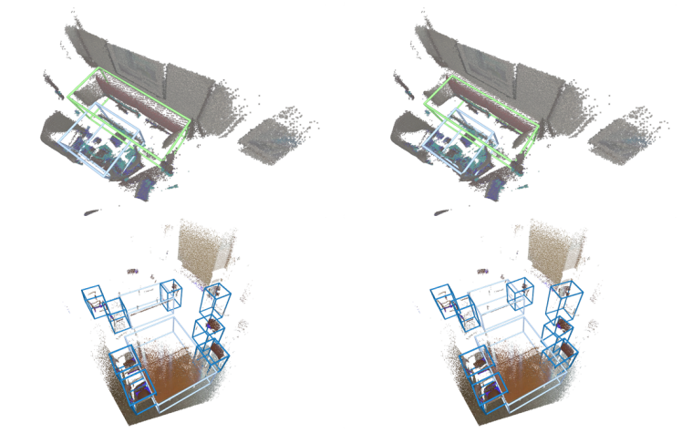

# V-DETR: DETR with Vertex Relative Position Encoding for 3D Object Detection

[](https://paperswithcode.com/sota/3d-object-detection-on-scannetv2?p=v-detr-detr-with-vertex-relative-position)

[](https://paperswithcode.com/sota/3d-object-detection-on-sun-rgbd-val?p=v-detr-detr-with-vertex-relative-position)


<div align="center">


</div>

## News

⛽ ⛽ ⛽ Contact: [yuhui.yuan@microsoft.com](yuhui.yuan@microsoft.com) 

**2024.01.16** V-DETR has been accepted by ICLR 2024 🍺

This is the official implementation of the paper "V-DETR: DETR with Vertex Relative Position Encoding for 3D Object Detection". 

Authors: Yichao Shen*, Zigang Geng*, Yuhui Yuan*, Yutong Lin, Ze Liu, Chunyu Wang, Han Hu, Nanning Zheng, Baining Guo

## Model Architecture
<div >



</div>

## Getting Started

### Installation
**Step 1.** Create a conda environment and activate it.

```shell
conda create --name vdetr python=3.8 -y
conda activate vdetr
```

**Step 2.** install requirements.

```bash
pip install -r requirements.txt
```

**Step 3.** install **Minkowski Engine**.

```bash
git clone https://github.com/NVIDIA/MinkowskiEngine.git
cd MinkowskiEngine
python setup.py install --blas_include_dirs=${CONDA_PREFIX}/include --blas=openblas
```
**Step 4.** install **mmcv**.

```bash
pip install openmim
mim install mmcv-full==1.6.1
```

**Step 5.** install third party support.

```bash
cd third_party/pointnet2/ && python setup.py install --user
cd ../..
cd utils && python cython_compile.py build_ext --inplace
cd ..
```

### Dataset preparation
**Scannet Data**
1. Download ScanNet v2 data [HERE](https://github.com/ScanNet/ScanNet). Move/link the `scans` folder such that under `scans` there should be folders with names such as `scene0001_01`.
2. Open the 'scannet' folder. Extract point clouds and annotations (semantic seg, instance seg etc.) by running `python batch_load_scannet_data.py`, which will create a folder named `scannet_train_detection_data` here.


## Testing (no TTA)
Once you have the datasets prepared, you can test pretrained models as
### test scripts
```shell
python main.py \
--dataset_name scannet \
--dataset_root_dir $your_scannet/scannet_train_detection_data/ \
--meta_data_dir $your_scannet/meta_data/ \
--test_only --test_ckpt $ckpt_path \
--auto_test
```
please add `--auto_test`, which can auto load the arguments of the checkpoint, and will use to initial the model and others. 

| Dataset | mAP@0.25(no TTA) | mAP@0.5(no TTA) | details | ckpt |
|:-------:|:--------:|:-------:|:-------:|:-------:|
| ScanNet | 77.85 | 65.91 | [result](results/scannet_result.txt)|[ckpt](https://huggingface.co/byshen/vdetr/blob/main/scannet_540ep.pth)

**Notes**: In the first version, we did not release the testing code with TTA as reported in the original paper. This is because our method has showed better performance after we addressed some minor issues during the refinement and cleaning of the source code, and we aim to present a clearer version for our key contributions. Simultaneously, we observed improved performance with TTA (AP25: 78+, AP50: 67+), which we plan to release soon for those seeking the best performance.

## Training
You can reproduce or train your own model as 
### train scripts
```shell
python main.py \
--dataset_name scannet \
--dataset_root_dir $your_scannet/scannet_train_detection_data/ \
--meta_data_dir $your_scannet/meta_data/ \
--ngpus 8 --batchsize_per_gpu 1 \
--hard_anchor
```

Please make sure the global `batchsize==8`, if using the default learning rate.


## Visualization
### ScanNet
<div >



</div>

### SUN RGB-D
<div >



</div>


## Citation
If you find this code useful in your research, please consider citing:
```
@article{V-DETR
      title={V-DETR: DETR with Vertex Relative Position Encoding for 3D Object Detection}, 
      author={Yichao Shen and Zigang Geng and Yuhui Yuan and Yutong Lin and Ze Liu and Chunyu Wang and Han Hu and Nanning Zheng and Baining Guo},
      year={2023},
      eprint={2308.04409},
      archivePrefix={arXiv},
      primaryClass={cs.CV}
}
```
