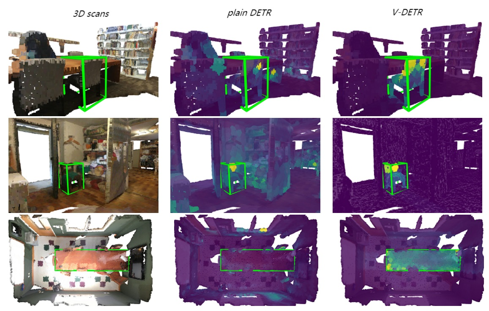

# V-DETR

[](https://paperswithcode.com/sota/3d-object-detection-on-scannetv2?p=v-detr-detr-with-vertex-relative-position)

[](https://paperswithcode.com/sota/3d-object-detection-on-sun-rgbd-val?p=v-detr-detr-with-vertex-relative-position)


<div align="center">



</div>

This is the official implementation of the paper "V-DETR: DETR with Vertex Relative Position Encoding for 3D Object Detection". 

Authors: Yichao Shen*, Zigang Geng*, Yuhui Yuan*, Yutong Lin, Ze Liu, Chunyu Wang, Han Hu, Nanning Zheng, Baining Guo

## Model
<div >


</div>

### results
| Dataset | mAP@0.25 | mAP@0.5 |
|:-------:|:--------:|:-------:|
| ScanNet | 77.8 (77.0) | 66.0 (65.3) 
| SUN RGB-D | 68.0 (67.5) | 51.1 (50.0) 

## Visualization
### ScanNet
<div >


</div>

### SUN RGB-D
<div >


</div>


## Citation
If you find this code useful in your research, please consider citing:
```
@article{V-DETR
      title={V-DETR: DETR with Vertex Relative Position Encoding for 3D Object Detection}, 
      author={Yichao Shen and Zigang Geng and Yuhui Yuan and Yutong Lin and Ze Liu and Chunyu Wang and Han Hu and Nanning Zheng and Baining Guo},
      year={2023},
      eprint={2308.04409},
      archivePrefix={arXiv},
      primaryClass={cs.CV}
}
```